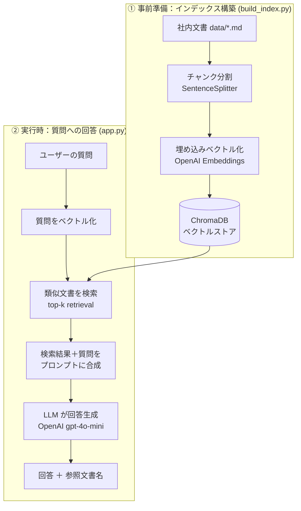

# faq-bot-mvp — 社内FAQ AIアシスタント（RAG）

人材派遣会社の**社内問い合わせ**（有給休暇・経費精算・就業規則・給与など）に対して、
**社内文書を根拠に AI が回答する**チャットボットの最小実装（MVP）です。

LlamaIndex + OpenAI + ChromaDB + Streamlit で構成した、
**Retrieval-Augmented Generation（RAG）** のシンプルかつ実際に動く例になっています。

> ⚠️ このリポジトリの `data/` に含まれる文書は、動作確認用に作成した**架空のサンプル**です。
> 実在する企業・団体の情報は含まれていません。

---

## 何を解決するのか

人材派遣の現場では、スタッフから「有給はいつ付与される？」「経費の締め日は？」といった
**定型的な問い合わせ**がコーディネーターに集中し、対応工数がかさみます。
一方でこの種の質問は、就業規則や各種規定など**既存の社内文書に答えが書いてある**ことがほとんどです。

そこで、社内文書を知識ベースとして取り込み、
**「文書に書かれている内容だけ」を根拠に自動回答する**アシスタントを作りました。
根拠となった文書名も一緒に提示することで、回答の裏取りができるようにしています。

## なぜ単純なチャットGPTではなく RAG なのか

LLM に社内規定をそのまま質問しても、モデルは社内文書を知らないため、
**もっともらしいが誤った回答（ハルシネーション）**を返してしまいます。

RAG は「①質問に関連する社内文書を検索してから、②その文書を根拠に回答させる」仕組みで、
- 回答を**手元の文書に接地（grounding）**させられる
- 文書を差し替えるだけで**再学習なしに知識を更新**できる
- **出典を提示**でき、回答の信頼性を担保できる

という利点があります。本実装では、プロンプトで「文書に無いことは推測せず、
"記載が見当たりません"と答える」よう明示し、ハルシネーションを抑えています。

## アーキテクチャ

処理は「事前準備（インデックス構築）」と「実行時（質問への回答）」の2フェーズに分かれます。



## 技術スタック

| 役割 | 使用技術 |
| --- | --- |
| RAG フレームワーク | LlamaIndex |
| LLM（回答生成） | OpenAI `gpt-4o-mini` |
| 埋め込み（ベクトル化） | OpenAI `text-embedding-3-small` |
| ベクトルDB | ChromaDB（ローカル永続化） |
| UI | Streamlit（チャット画面） |
| テスト | pytest（モデルをモック化しAPI不要で検証） |

## ディレクトリ構成

```
faq-bot-mvp/
├── app.py              # Streamlit チャットUI（エントリポイント）
├── build_index.py      # インデックス構築コマンド
├── data/               # 知識ソース（架空のサンプル社内FAQ）
├── src/
│   ├── config.py       # 設定値・プロンプト
│   ├── store.py        # ChromaDB 接続
│   ├── ingest.py       # 文書取り込み → 分割 → 埋め込み → 保存
│   └── rag.py          # 検索 ＋ 回答生成
├── tests/
│   └── test_pipeline.py # モックを使ったパイプライン検証
├── requirements.txt
└── .env.example        # APIキー設定の雛形
```

## セットアップと実行

前提: Python 3.10 以上、OpenAI の API キー。

```bash
# 1. リポジトリを取得
git clone https://github.com/shun-kakizawa/faq-bot-mvp.git
cd faq-bot-mvp

# 2. 仮想環境を作成し、依存をインストール
python -m venv .venv
source .venv/bin/activate        # Windows: .venv\Scripts\activate
pip install -r requirements.txt

# 3. APIキーを設定（.env.example をコピーして編集）
cp .env.example .env             # Windows: copy .env.example .env
#   .env を開き、OPENAI_API_KEY=sk-... を自分のキーに書き換える

# 4. 社内文書を読み込んでインデックスを構築（初回のみ）
python build_index.py

# 5. アプリを起動
streamlit run app.py
```

ブラウザで開いたチャット画面に質問を入力すると、回答と参照した文書名が表示されます。

### 質問例

- 有給休暇は入社何か月で付与されますか？
- 経費精算の締め日はいつですか？
- 6時間を超えて働くとき、休憩は何分必要ですか？
- 給与の支払日を教えてください。

## テスト

OpenAI の API を呼ばずに（＝コストをかけずに）、
「文書取り込み → 検索 → 回答生成」の配線が壊れていないことを検証できます。
LLM と埋め込みモデルを LlamaIndex のモックに差し替えて実行します。

```bash
pytest -q
```

## 設計上の工夫

- **ハルシネーション対策**: 回答プロンプトで「渡した文書だけを根拠にし、
  無い情報は推測せず"記載なし"と答える」よう制約（`src/config.py`）。
- **出典の提示**: 回答に、根拠として検索された文書名を併記（`src/rag.py`）。
- **秘密情報の分離**: APIキーは `.env` に置き、`.gitignore` で除外。
  リポジトリには雛形 `.env.example` のみを含める。
- **設定の一元化**: モデル名・チャンクサイズ・検索件数などを `config.py` に集約し、
  チューニングしやすくした。
- **コスト0で回るテスト**: モデルをモック化し、CI でも回せる軽量なパイプラインテストを用意。

## 今後の拡張（Future Work）

- 会話履歴を踏まえた追い質問への対応（マルチターン化）
- 検索精度向上のためのリランキング（reranker）の導入
- PDF・Excel 等、多様な社内文書フォーマットへの対応
- 回答の評価（正答率・出典の妥当性）を測る仕組みの整備
- 権限に応じて参照できる文書を制御するアクセス制御

---

作成: [@shun-kakizawa](https://github.com/shun-kakizawa)
